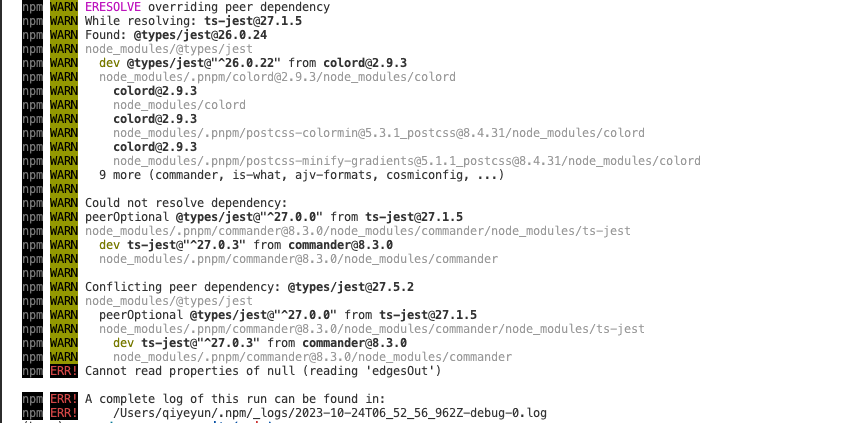

# goods-manager-pc

## Project setup
```
pnpm install
```

### Compiles and hot-reloads for development
```
pnpm run serve
```

### Compiles and minifies for production
```
pnpm run build
```

### Lints and fixes files
```
pnpm run lint
```

### Customize configuration
See [Configuration Reference](https://cli.vuejs.org/config/).


# 学习视频

[BiliBili  -  Vue2-第二版-后台管理系统项目实战/vue+element-ui/vue经典全套系统案例讲解](https://www.bilibili.com/video/BV1j5411o7xH/?spm_id_from=333.337.search-card.all.click&vd_source=dc55c355e9f5b6174832aacfb5d8b6aa)

[墨刀UI](https://modao.cc/app/nNLKV9otrlszqxCFL6pGT#screen=slatpczos4pipxz)


# 一、项目构建

```bash
$ vue create goods-manager-pc
```


## 1. element-ui

[element 2.0官网](https://element.eleme.cn/#/zh-CN/component/installation)

**npm 安装**
推荐使用 npm 的方式安装，它能更好地和 webpack 打包工具配合使用。

```bash
$ npm i element-ui -S
```



**npm安装失败，使用pnpm**

```bash
$ pnpm add element-ui
```


## 2. babel-plugin-component

**element-ui 按需引入**

借助 [babel-plugin-component](https://github.com/QingWei-Li/babel-plugin-component)，我们可以只引入需要的组件，以达到减小项目体积的目的。

首先，安装 babel-plugin-component：

```bash
$ npm install babel-plugin-component -D

# 命令报错，使用pnpm
$ pnpm add babel-plugin-component -D
```

然后，将 .babelrc 修改为：

```json
{
  "presets": [["es2015", { "modules": false }]],
  "plugins": [
    [
      "component",
      {
        "libraryName": "element-ui",
        "styleLibraryName": "theme-chalk"
      }
    ]
  ]
}
```


## 3. axios

```bash
$ pnpm add axios 
```


## 4. querystring

```bash
$ pnpm add querystring -S
```


## 5. normalize.css 

```bash
$ pnpm add normalize.css -S 
```


## 6. echarts

```bash
$ pnpm add echarts -S 
```


# 三、模拟服务端

## 1. 模拟本地服务器 - express
```
  "server-express": "npx nodemon ./server/index.js",
```
Express是一个流行的Node.js Web应用程序框架，用于构建Web应用程序和API。它提供了一组强大的功能和工具，使得在Node.js环境中构建Web应用程序变得更加简单和高效。

Nodemon是一个Node.js应用程序的热重载工具，它监视文件系统中的文件更改，并自动重启Node应用程序。

## 2. 模拟本地服务器 - http-server

```
  "server-http-server": "npx http-server ./server/database",
```

## 3. 模拟本地服务器 - json-server
```
  "server-json-server": "json-server --watch ./server/database/db.json"
```


